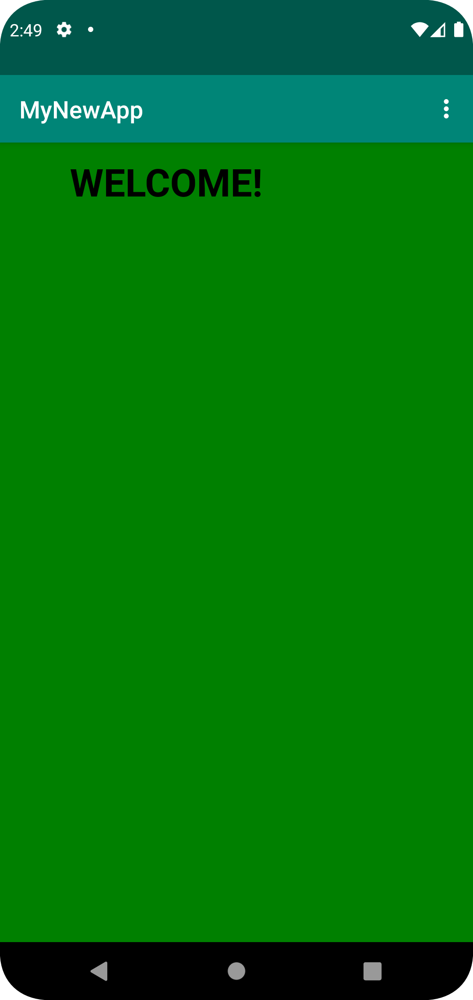
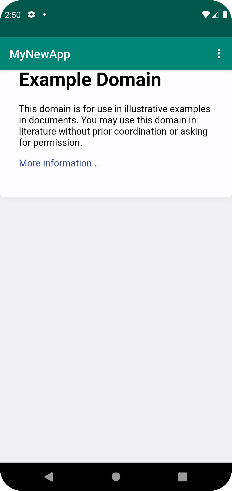

# Rapport

För att ändra namnet på appen ändrades stringen *app_name* vilket ligger i res -> values -> strings.xml
Namnet blev "MyNewApp".

För att tillåta internet åtkomst för appen behövs en rad kod läggas till i AndroidManifest.xml filen,
inom <Manifest> taggen:
```
    <uses-permission android:name="android.permission.INTERNET"/>
```
Denna rad kod get tillåtelse till internet.

För att kunna visa websidor och kunna klicka på länkar måste TextView elementet bytas ut mot ett
WebView element i activity.main filen:
```
    <WebView
        android:id="@+id/my_webview"
        android:layout_width="match_parent"
        android:layout_height="match_parent" />
```

Nu måste WebView elementet på något sätt kunna referas till, vilket är varför en privat WebView variabel
vid namn _myWebView_ skapas i MainActivity.java, som sedan instansieras i onCreate() vilket gör att att WebView
elementet instansieras när appen öppnas.

Eftersom användaren ska stanna kvar på appen när en extern hemsida öppnas ska en WebViewClient fästas
på WebView, detta förhindrar att en tredjeparts browser öppnas och sidan visas istället i appen. För att 
göra detta används WebView ID för att hitta den och sedan setWebViewClient():
```
    myWebView = (WebView) findViewById(R.id.my_webview);
    myWebView.setWebViewClient(new WebViewClient());
```

För att sedan kunna öppna externa och interna websidor måste javascript aktiverats, detta kräver
endast två rader kod i onCreate() metoden:
```
    WebSettings webSettings = myWebView.getSettings();
    webSettings.setJavaScriptEnabled(true);
```

Inom showExternalWebPage() länkas det till en hemsida och showInternalWebPage() i länkas det med
filvägen till den html fil som skapats i assets mappen, HTML filen kallas interPage.html och koden
är som sådan:
```
    <!DOCTYPE html>
    <html>
        <body style="background-color:green;">
            <h1 style="padding: 50px">WELCOME!</h1>
        </body>
    </html>
```
Det är en enkel HTML sida som blir röd och det står "WELCOME". Bild på den internela sidan:


Bild på externa sidan som länkar till example.com:
